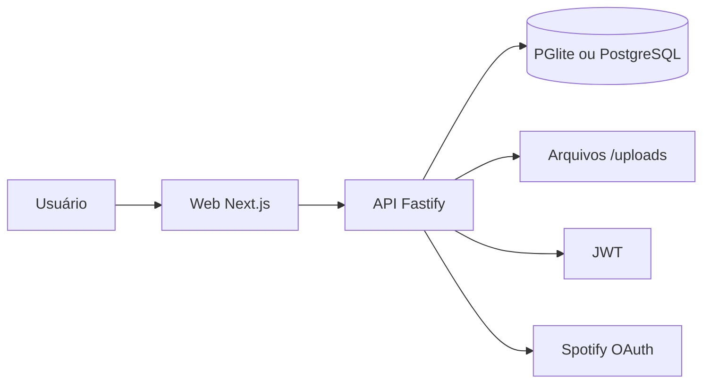

# 🎉 Resenhômetro

> É os mais bigodes da capital krai.

Rede social de experiências, rolês e memórias. As pessoas registram os encontros que viveram, com quem estavam, as músicas, as fotos, os áudios e as histórias que ficaram.

Repositório: [github.com/Jean-Griggi/radar-de-resenha](https://github.com/Jean-Griggi/radar-de-resenha)

---

# 📖 Sobre

O **Resenhômetro** não é só um cadastro de rolês. É um diário social: feed, perfil, calendário, estatísticas, resenhas e música.

A branch única do projeto é a **`main`**.

---

# ✨ O que já existe

- Cadastro, login, sessão JWT e perfil (`/perfil/[username]`)
- Foto de perfil e capa
- Rolês: criar, listar, editar, excluir, presença (vou / talvez / não vou)
- Feed, comentários com respostas e reações
- Amigos, seguir, explorar e busca
- Resenhas com nota 1–5 e tags
- Fotos, álbuns e áudios
- Calendário, estatísticas, retrospectiva e conquistas
- Notificações dentro do app
- Spotify (OAuth no backend; precisa das variáveis de ambiente)
- Tema claro e tema escuro, com fundo de waves
- Persistência local (PGlite) ou PostgreSQL via `DATABASE_URL`

Fora do escopo agora: app mobile, app desktop, mapa, chat em tempo real e push.

---

# 🏛️ Arquitetura



Backend: `routes` → `service` → banco/arquivos.

---

# 🛠️ Stack

| Camada | Tecnologia |
| ------ | ---------- |
| Web | Next.js, React, TypeScript, Tailwind CSS |
| API | Fastify, TypeScript, JWT, bcrypt, Zod |
| Tipos | `packages/shared` |
| Banco | PGlite (padrão local) ou PostgreSQL |
| Mídia | Disco em `apps/api/data/uploads` |
| Testes | Vitest na API |

---

# 💻 Pré-requisitos

| Ferramenta | Versão |
| ---------- | ------ |
| [Git](https://git-scm.com/downloads) | recente |
| [Node.js](https://nodejs.org/) | 20+ |
| [pnpm](https://pnpm.io/installation) | 10+ |

Docker é opcional (só se quiser PostgreSQL de verdade). Sem Docker a API já persiste os dados.

---

# 🚀 Como rodar

```bash
git clone https://github.com/Jean-Griggi/radar-de-resenha.git
cd radar-de-resenha
pnpm install
```

**Windows (PowerShell):**

```powershell
Copy-Item .env.example .env
Copy-Item .env.example apps/web/.env.local
```

**Linux / macOS:**

```bash
cp .env.example .env
cp .env.example apps/web/.env.local
```

No `apps/web/.env.local` deixe só (ou pelo menos):

```
NEXT_PUBLIC_API_URL=http://localhost:3333
```

Dois terminais:

```bash
pnpm --filter @resenhometro/api dev
pnpm --filter @resenhometro/web dev
```

Ou, na raiz, `pnpm dev` (sobe os apps do monorepo).

| App | URL |
| --- | --- |
| Web | http://localhost:3000 |
| API | http://localhost:3333 |

```bash
curl http://localhost:3333/health
```

Resposta: `{"status":"ok"}`. Cadastre uma conta no navegador e entre.

---

# 📋 Comandos

| Comando | O que faz |
| ------- | --------- |
| `pnpm install` | Dependências |
| `pnpm --filter @resenhometro/api dev` | API |
| `pnpm --filter @resenhometro/web dev` | Web |
| `pnpm build` | Build |
| `pnpm lint` | Lint |
| `pnpm typecheck` | TypeScript |
| `pnpm test` | Testes da API |
| `pnpm format` | Prettier |

---

# ❓ Problemas comuns

| Problema | Solução |
| -------- | ------- |
| `pnpm` não encontrado | `npm install -g pnpm` |
| Login antigo não entra | Banco local foi zerado — cadastre de novo |
| Porta 3000 ou 3333 em uso | Feche o processo ou mude `API_PORT` |
| Spotify não conecta | Preencha `SPOTIFY_*` no `.env` |

---

# 📂 Estrutura

```text
radar-de-resenha/
├── apps/api/          Backend Fastify
├── apps/web/          Frontend Next.js
├── apps/mobile/       Reservado (não usar agora)
├── apps/desktop/      Reservado (não usar agora)
├── packages/shared/   Tipos e constantes
├── packages/ui/       Componentes (mínimo)
├── packages/config/   TSConfig compartilhado
├── docs/              Documentação
├── docker-compose.yml PostgreSQL opcional
└── README.md
```

---

# 🌿 Git

A branch de trabalho é a **`main`**. Não há `develop` nem branches de feature ativas.

Commits no padrão Conventional Commits: `feat:`, `fix:`, `docs:`, `refactor:`, `test:`, `chore:`.

---

# ☁️ Publicar

O GitHub guarda o código. Para o site ficar na internet:

1. **Front (Vercel)** — root `apps/web`, variável `NEXT_PUBLIC_API_URL`
2. **API (Render ou Railway)** — `JWT_SECRET`, `PUBLIC_API_URL`, `WEB_ORIGIN`, `CORS_ORIGINS`, opcionalmente `DATABASE_URL` e `SPOTIFY_*`

---

# 👥 Equipe

Jean, João, Adryan, Rafael, Lucas, Niel, Davi, Gabriel

---

# 📄 Licença

Projeto privado, uso interno da equipe.
