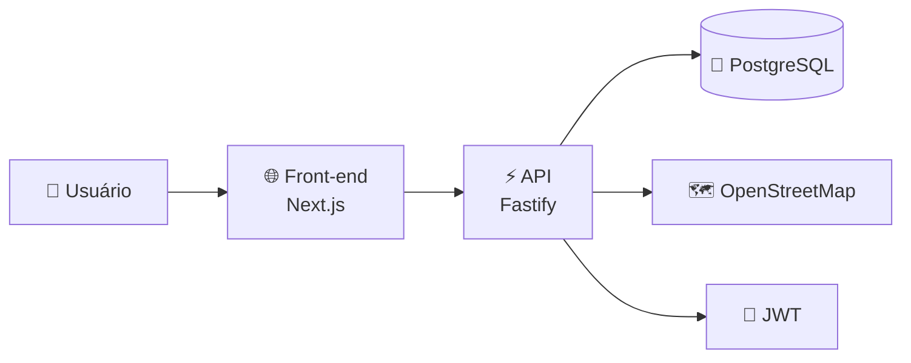
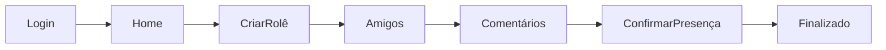
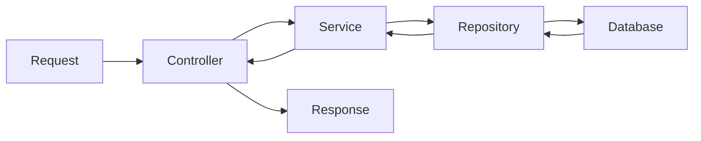
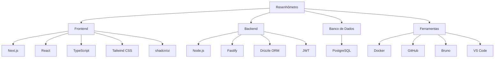
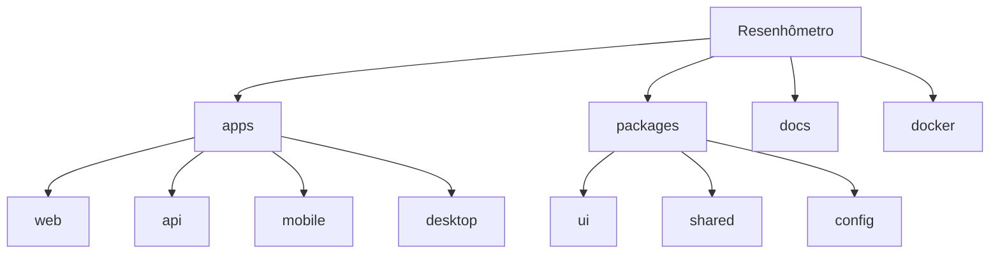
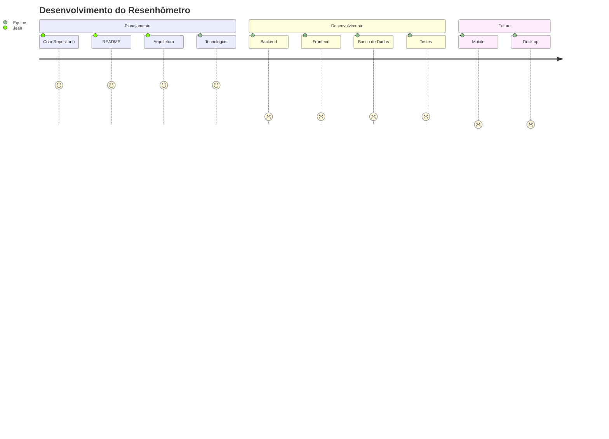

# 🎉 Resenhômetro

> É os mais bigodes da capital krai.

---

# 📖 Sobre

O **Resenhômetro** é uma plataforma desenvolvida para facilitar a organização de encontros entre amigos.

O sistema permitirá criar rolês, confirmar presença, compartilhar localização, comentar, avaliar encontros e centralizar todas as informações importantes em um único lugar.

Nosso objetivo é tornar a organização de rolês mais simples, rápida e divertida.

---

# ✨ Funcionalidades

- 👤 Cadastro e Login
- 🧑 Perfil de usuário
- 🎉 Criar rolês
- ✏️ Editar rolês
- 🗑️ Excluir rolês
- 📍 Localização do encontro
- 💬 Comentários
- ⭐ Avaliação dos rolês
- ✅ Confirmar presença
- ❌ Informar ausência
- 💰 Informar gastos
- 📷 Fotos (futuro)
- 🔔 Notificações (futuro)

---

# 🏛️ Arquitetura Geral



---

# 🚀 Fluxo do Usuário



---

# ⚙️ Fluxo do Backend



---

# 🛠️ Stack de Tecnologias



---

# 📚 Tecnologias

## 🌐 Front-end

| Tecnologia      | Utilização             |
| --------------- | ---------------------- |
| Next.js         | Framework React        |
| React           | Interface da aplicação |
| TypeScript      | Tipagem                |
| Tailwind CSS    | Estilização            |
| shadcn/ui       | Componentes            |
| React Hook Form | Formulários            |
| Zod             | Validação              |
| Axios           | Comunicação com API    |

---

## ⚡ Back-end

| Tecnologia  | Utilização            |
| ----------- | --------------------- |
| Node.js     | Ambiente JavaScript   |
| Fastify     | Framework da API      |
| TypeScript  | Tipagem               |
| Drizzle ORM | ORM                   |
| JWT         | Autenticação          |
| bcrypt      | Criptografia de senha |

---

## 🐘 Banco de Dados

- PostgreSQL

---

## 🗺️ Mapas

- OpenStreetMap
- Leaflet

---

## 🧪 Testes

- Vitest
- Bruno

---

## 🐳 Infraestrutura

- Docker
- Docker Compose

---

# 💻 Pré-requisitos

Antes de clonar o repositório, instale estas ferramentas na sua máquina:

| Ferramenta | Para quê? | Versão mínima |
| ---------- | --------- | ------------- |
| [Git](https://git-scm.com/downloads) | Clonar e versionar o código | Qualquer recente |
| [Node.js](https://nodejs.org/) | Rodar JavaScript/TypeScript | 20 ou superior |
| [pnpm](https://pnpm.io/installation) | Gerenciar dependências do monorepo | 10 ou superior |

> **Opcional:** [VS Code](https://code.visualstudio.com/) ou [Cursor](https://cursor.com/) como editor, e [Bruno](https://www.usebruno.com/) para testar a API.

---

# 🛠️ Instalação das ferramentas

Siga os passos abaixo **uma única vez** por máquina.

## 1. Git

**Windows:** baixe em [git-scm.com/downloads](https://git-scm.com/downloads) e instale com as opções padrão.

Verifique no terminal:

```bash
git --version
```

## 2. Node.js

Baixe a versão **LTS (20 ou superior)** em [nodejs.org](https://nodejs.org/).

Verifique:

```bash
node --version
npm --version
```

Deve aparecer algo como `v20.x.x` ou `v22.x.x`.

## 3. pnpm

O pnpm é o gerenciador de pacotes do projeto. Instale globalmente:

```bash
npm install -g pnpm
```

Verifique:

```bash
pnpm --version
```

> **Alternativa:** se preferir, ative o Corepack (já vem com o Node):
>
> ```bash
> corepack enable
> corepack prepare pnpm@10.11.0 --activate
> ```

---

# 🚀 Como rodar o projeto

Depois de instalar os pré-requisitos, siga estes passos toda vez que for trabalhar no projeto (ou na primeira vez após clonar).

## 1. Clonar o repositório

```bash
git clone https://github.com/SEU-USUARIO/radar-de-resenha.git
cd radar-de-resenha
```

> Troque a URL pelo link real do repositório no GitHub.

## 2. Instalar as dependências

Na **raiz do projeto**, rode:

```bash
pnpm install
```

Esse comando baixa automaticamente todas as bibliotecas do monorepo (Next.js, Fastify, React, TypeScript, etc.) — **não precisa instalar cada uma manualmente**.

## 3. Configurar variáveis de ambiente

Copie o arquivo de exemplo:

```bash
# Windows (PowerShell)
Copy-Item .env.example .env

# Linux / macOS
cp .env.example .env
```

Edite o `.env` se precisar alterar algo.

## 4. Rodar o projeto

```bash
pnpm dev
```

| App | URL |
| --- | --- |
| Web (Next.js) | http://localhost:3000 |
| API (Fastify) | http://localhost:3333 |

Teste a API:

```bash
curl http://localhost:3333/health
```

Resposta esperada: `{"status":"ok"}`

---

# 📋 Comandos úteis

| Comando | O que faz |
| ------- | --------- |
| `pnpm install` | Instala/atualiza dependências |
| `pnpm dev` | Sobe web + api em modo desenvolvimento |
| `pnpm build` | Gera build de produção |
| `pnpm lint` | Verifica qualidade do código |
| `pnpm typecheck` | Verifica erros de TypeScript |
| `pnpm format` | Formata o código com Prettier |

---

# ❓ Problemas comuns

| Problema | Solução |
| -------- | ------- |
| `pnpm: command not found` | Instale o pnpm (`npm install -g pnpm`) |
| `node: command not found` | Instale o Node.js 20+ |
| Porta 3000 ou 3333 em uso | Feche o processo que está usando a porta ou mude no `.env` |
| Erro no `pnpm install` | Use Node 20+ e pnpm 10+ |

---

# 📂 Estrutura do Projeto

```text
resenhometro/
│
├── apps/
│   ├── api/
│   ├── web/
│   ├── mobile/
│   └── desktop/
│
├── packages/
│   ├── ui/
│   ├── shared/
│   └── config/
│
├── docs/
│
├── docker/
│
├── .github/
│
└── README.md
```

---

# 🗂️ Organização do Monorepo



---

# 📖 O que é cada pasta?

| Pasta           | Objetivo                          |
| --------------- | --------------------------------- |
| apps/api        | API Backend                       |
| apps/web        | Aplicação Web                     |
| apps/mobile     | Aplicativo Mobile (futuro)        |
| apps/desktop    | Aplicativo Desktop (futuro)       |
| packages/ui     | Componentes reutilizáveis         |
| packages/shared | Código compartilhado              |
| packages/config | Configurações compartilhadas      |
| docs            | Documentação                      |
| docker          | Arquivos Docker                   |

---

# 🌱 Git Flow

```text
main
 │
 ├── develop
 │
 ├── feature/login
 ├── feature/roles
 ├── feature/usuarios
 ├── fix/login
 └── hotfix/producao
```

---

# 🌿 Padrão de Branches

```
feature/nome-da-feature
fix/nome-do-bug
hotfix/nome-do-hotfix
docs/documentacao
refactor/refatoracao
```

---

# 📝 Padrão de Commits

```
feat:
fix:
docs:
style:
refactor:
test:
chore:
```

Exemplo:

```
feat: cria sistema de login

fix: corrige autenticação JWT

docs: atualiza README

refactor: reorganiza estrutura da API
```

---

# 📅 Roadmap



---

# 👥 Equipe/Usuarios

- Jean
- João
- Adryan
- Rafael
- Lucas
- Niel
- Davi
- Gabriel

---

# 🎯 Objetivos do Projeto

- Aprender novas tecnologias
- Praticar desenvolvimento em equipe
- Criar um projeto real
- Melhorar conhecimentos em arquitetura
- Evoluir em Git e GitHub
- Desenvolver um sistema útil para o grupo

---

# 📄 Licença

Este projeto é privado e foi desenvolvido para uso interno entre os guri.
