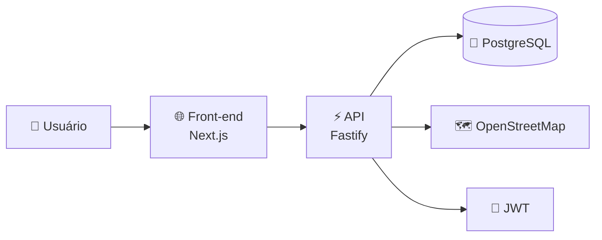
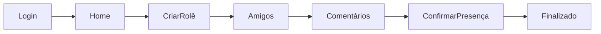
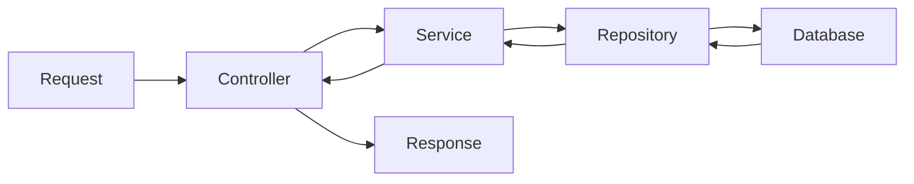
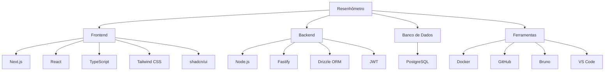
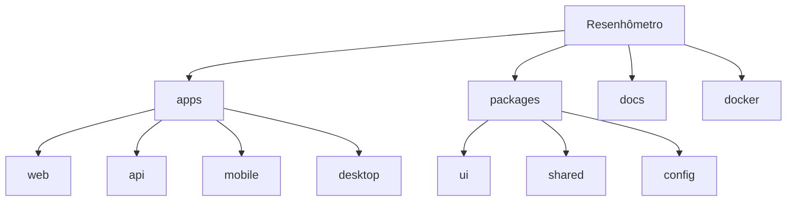
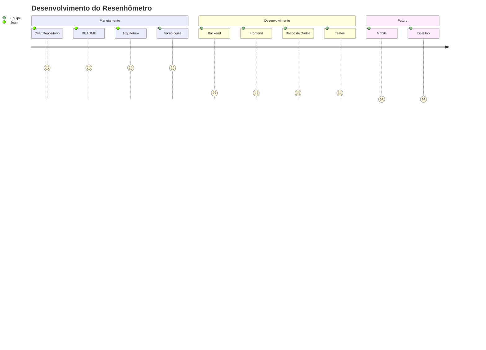

# 🎉 Resenhômetro

> É os mais bigodes da capital krai.

---

# 📖 Sobre

O **Resenhômetro** é uma plataforma desenvolvida para facilitar a organização de encontros entre amigos.

O sistema permitirá criar rolês, confirmar presença, compartilhar localização, comentar, avaliar encontros e centralizar todas as informações importantes em um único lugar.

Nosso objetivo é tornar a organização de rolês mais simples, rápida e divertida.

---

# ✨ Funcionalidades

- 👤 Cadastro e Login
- 🧑 Perfil de usuário
- 🎉 Criar rolês
- ✏️ Editar rolês
- 🗑️ Excluir rolês
- 📍 Localização do encontro
- 💬 Comentários
- ⭐ Avaliação dos rolês
- ✅ Confirmar presença
- ❌ Informar ausência
- 💰 Informar gastos
- 📷 Fotos (futuro)
- 🔔 Notificações (futuro)

---

# 🏛️ Arquitetura Geral



---

# 🚀 Fluxo do Usuário



---

# ⚙️ Fluxo do Backend



---

# 🛠️ Stack de Tecnologias



---

# 📚 Tecnologias

## 🌐 Front-end

| Tecnologia | Utilização |
|------------|------------|
| Next.js | Framework React |
| React | Interface da aplicação |
| TypeScript | Tipagem |
| Tailwind CSS | Estilização |
| shadcn/ui | Componentes |
| React Hook Form | Formulários |
| Zod | Validação |
| Axios | Comunicação com API |

---

## ⚡ Back-end

| Tecnologia | Utilização |
|------------|------------|
| Node.js | Ambiente JavaScript |
| Fastify | Framework da API |
| TypeScript | Tipagem |
| Drizzle ORM | ORM |
| JWT | Autenticação |
| bcrypt | Criptografia de senha |

---

## 🐘 Banco de Dados

- PostgreSQL

---

## 🗺️ Mapas

- OpenStreetMap
- Leaflet

---

## 🧪 Testes

- Vitest
- Bruno

---

## 🐳 Infraestrutura

- Docker
- Docker Compose

---

# 📂 Estrutura do Projeto

```text
resenhometro/
│
├── apps/
│   ├── api/
│   ├── web/
│   ├── mobile/
│   └── desktop/
│
├── packages/
│   ├── ui/
│   ├── shared/
│   └── config/
│
├── docs/
│
├── docker/
│
├── .github/
│
└── README.md
```

---

# 🗂️ Organização do Monorepo



---

# 📖 O que é cada pasta?

| Pasta | Objetivo |
|--------|----------|
| apps/api | API Backend |
| apps/web | Aplicação Web |
| apps/mobile | Aplicativo Mobile (futuro) |
| apps/desktop | Aplicativo Desktop (futuro) |
| packages/ui | Componentes reutilizáveis |
| packages/shared | Código compartilhado |
| packages/config | Configurações compartilhadas |
| docs | Documentação |
| docker | Arquivos Docker |

---

# 🌱 Git Flow

```text
main
 │
 ├── develop
 │
 ├── feature/login
 ├── feature/roles
 ├── feature/usuarios
 ├── fix/login
 └── hotfix/producao
```

---

# 🌿 Padrão de Branches

```
feature/nome-da-feature
fix/nome-do-bug
hotfix/nome-do-hotfix
docs/documentacao
refactor/refatoracao
```

---

# 📝 Padrão de Commits

```
feat:
fix:
docs:
style:
refactor:
test:
chore:
```

Exemplo:

```
feat: cria sistema de login

fix: corrige autenticação JWT

docs: atualiza README

refactor: reorganiza estrutura da API
```

---

# 📅 Roadmap



---

# 👥 Equipe/Usuarios

- Jean
- João
- Adryan
- Rafael
- Lucas
- Niel
- Davi
- Gabriel

---

# 🎯 Objetivos do Projeto

- Aprender novas tecnologias
- Praticar desenvolvimento em equipe
- Criar um projeto real
- Melhorar conhecimentos em arquitetura
- Evoluir em Git e GitHub
- Desenvolver um sistema útil para o grupo

---

# 📄 Licença

Este projeto é privado e foi desenvolvido para uso interno entre os guri.
